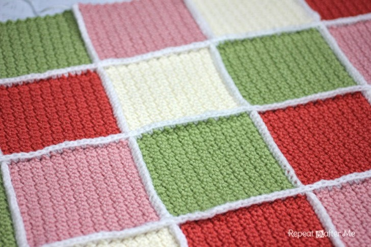
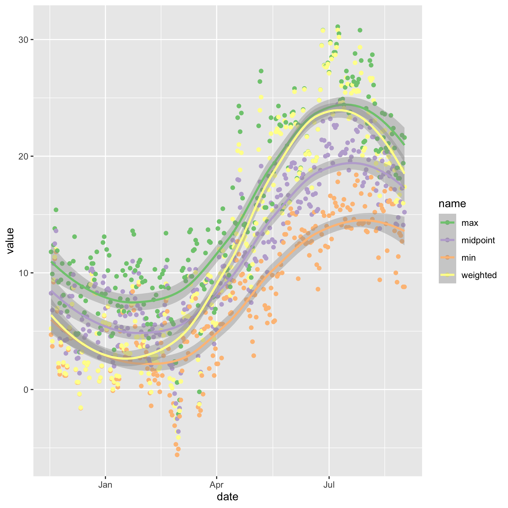
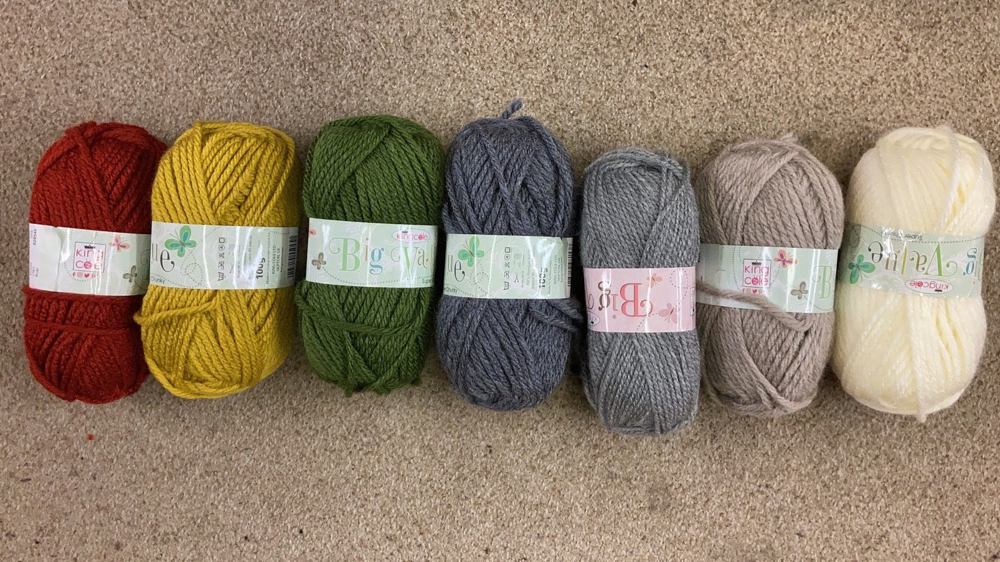

# Temperature blanket

## First one

Inspired by: https://www.ravelry.com/patterns/library/tunisian-temperature-blanket

- 280 days of pregnancy
- Start date: 2017-11-18
- Due date: 2018-08-25
- Assume 94 days per trimester
- 7 colours
    - below 0
    - 0-4
    - 5-9
    - 10-14
    - 15-19
    - 20-24
    - 25+

Obtain temperature records from here  http://www.martynhicks.uk/weather/data.php?page=months

## Second one

Inspired by: https://repeatcrafterm.wpengine.com/2014/04/solid-granny-square-crochet-pattern.html

e.g.

Single temperature per day - how to determine the colour? e.g. minimum would be too low in summer, maximum too high in winter, mean won't capture highs and lows. Would like to capture the hot days in summer and the cold days in winter. Create a weighted daily temperature in which the weights are based on a sinusoidal wave - overrepresenting maximum temperature in summer and overrepresenting minimum temperature in winter.

Based on First blanket, here is how the daily temperatures could be represented:

The weighted method has larger range.

Colours:

