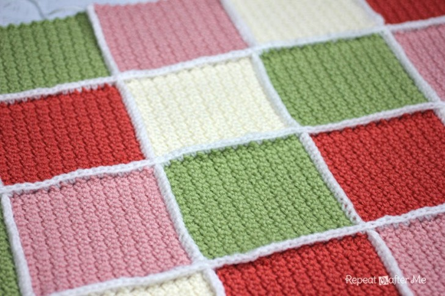
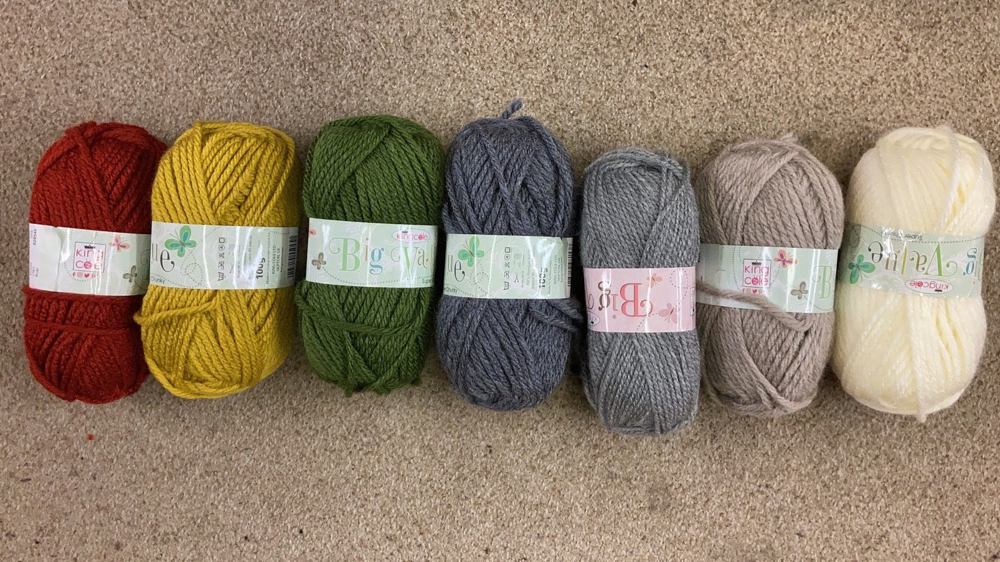

```{r}
suppressWarnings(suppressPackageStartupMessages({
	library(tidyverse)
	library(rvest)
	library(lubridate)
	library(ggthemes)
	library(knitr)
}))
knitr::opts_chunk$set(cache=TRUE, warning=FALSE, message=FALSE, dev="png")
```

Temperature blanket - granny squares - one square per day. Colour represents the temperature of that day. A bit like this:



Inspired by https://repeatcrafterm.wpengine.com/2014/04/solid-granny-square-crochet-pattern.html

## Size

Using super chunky yarn. 6 x 6 single crochet square is about 10cm. 280 days of pregnancy so divide into 20 rows and 14 columns - 2m by 1.4m? Seems pretty big... nevermind should be ok

## Colours

Picked out seven colours:



They roughly translate to these hex codes:

```{r}
colours <- tribble(
	~code, ~hex, ~temp,
	1, "#f4ead7", "<0",
	2, "#b5a49c", "0-4",
	3, "#6a6a6c", "4-9",
	4, "#424450", "9-14",
	5, "#616f4d", "14-19",
	6, "#d4b13d", "19-24",
	7, "#892c1b", ">24",
)
co <- colours$hex
names(co) <- colours$temp

colours %>%
mutate(y=1) %>%
	ggplot(aes(x=code, y)) +
	geom_bar(stat="identity", aes(fill=as.factor(temp))) +
	scale_fill_manual(values=co) +
	theme_void() +
	theme(legend.position="") +
	geom_text(aes(y=0.5, label=temp))
```

## Temperature mapping

Ideally would plot the high and the low, but is there a good solution for a single colour? If we use the mean then it makes cold days look too warm and warm days look too cool. Maximum will only properly represent the hotness of hot days and minimum will only represent the coolness of cool days.

Propose a solution to choose a temperature value that lies somewhere between minimum and maximum, with it being closer to the minimum in winter and closer to the maximum in summer. We could do this by weighting the mean of the min and max by the day length. 

Use a cosine function to map values between 0 and 1 - which is the weight of the maximum temperature. For the $i$th day after the summer solstice the weight $w_i$ will be:

$$
w_i = (Cos(\frac{2 \pi x_i}{365}) + 1) / 2
$$

and so the temperature value for that day will be

$$
T = w T_{max} + (1-w) T_{min}
$$

Gestation length is 280 days, with x ranging from the number of days after the summer solstice to that plus 280.

This is what the weighting looks like:

```{r}
fit_cos <- function(firstday, lastday)
{
	y1 <- year(firstday)
	if(firstday > paste0(y1, "/06/21"))
	{
		ss <- paste0(y1+1, "/06/21") %>% ymd()
	} else {
		ss <- paste0(y1, "/06/21") %>% ymd()
	}

	if(firstday > paste0(y1, "/12/21"))
	{
		ws <- paste0(y1+1, "/12/21") %>% ymd()
	} else {
		ws <- paste0(y1, "/12/21") %>% ymd()
	}

	d <- tibble(
		date = seq(firstday, firstday + days(365), by="days"),
		day = 1:length(date),
		x = seq(0, 2 * pi * length(date)/365, length.out=length(date)),
		y = cos(x)
	)
	i <- which(d$date == ss)
	d$y2 <- d$y
	index1 <- i:max(d$day)
	d$y2[index1] <- d$y[1:length(index1)]
	index2 <- 1:i
	d$y2[index2] <- d$y[length(index1):nrow(d)]
	d$y <- (d$y2 + 1) / 2
	d <- select(d, -y2)
	d <- subset(d, date <= lastday)
	return(d)
}

fit_cos(ymd("2020/10/25"), ymd("2020/10/25")+days(280)) %>%
ggplot(aes(x=date, y=y)) +
geom_line() +
labs(y="temperature weighting")
```

## Getting temperatures

Bristol daily min and max temperatures published on this website: http://www.martynhicks.uk/weather/data.php?page=m10y2020

Data uploaded on a monthly basis. Scrape temperatures:

```{r}
scrape_temperatures <- function(startdate)
{
	url <- "http://www.martynhicks.uk/weather/data.php?page="

	# Don't look for the current month it won't be up yet
	prevm <- ymd(
		paste(
			year(today()-months(1)),
			month(today()-months(1)),
			days_in_month(today()-months(1))
		)
	)
	to <- min(prevm, startdate + days(280))

	months <- seq(startdate, to, by="month")
	dat <- lapply(months, function(d)
	{
		message(d)
		Sys.sleep(2)
		x <- read_html(paste0(url, "m", formatC(month(d), digits=1, flag="0", format="d"), "y", year(d))) %>%
			html_nodes("table") %>%
			{.[4]} %>%
			html_nodes("tr") %>%
			{.[4]} %>%
			html_nodes("td") %>%
			{
				tibble(
					year = year(d),
					month = month(d),
					max = .[2] %>% html_text() %>% scan(text=., what="") %>% as.numeric(),
					min = .[3] %>% html_text() %>% scan(text=., what="") %>% as.numeric(),
					ave = .[4] %>% html_text() %>% scan(text=., what="") %>% as.numeric(),
				)
			} %>%
			mutate(
				day = 1:n(),
				date = ymd(paste(year, month, day))
			) %>%
			filter(!is.na(max) & date >= startdate & date <= (startdate + days(279))) %>%
			select(date, everything(), -year, -month, -day)
			return(x)
	}) %>% 
		bind_rows() %>%
		filter(date >= startdate)
	return(dat)
}
```

And convert temperatures to colours:

```{r}
convert_temperatures <- function(dat)
{
	startdate <- dat$date[1]
	sindat <- fit_cos(startdate, startdate + days(280))
	res <- left_join(dat, sindat, by="date") %>%
		mutate(
			temperature = (max * y + min * (1-y)),
			col_sin = case_when(
				temperature < 0 ~ "<0",
				temperature <= 4 ~ "0-4",
				temperature <= 9 ~ "4-9",
				temperature <= 14 ~ "9-14",
				temperature <= 19 ~ "14-19",
				temperature <= 24 ~ "19-24",
				TRUE ~ ">24"
			),
			col_ave = case_when(
				ave < 0 ~ "<0",
				ave <= 4 ~ "0-4",
				ave <= 9 ~ "4-9",
				ave <= 14 ~ "9-14",
				ave <= 19 ~ "14-19",
				ave <= 24 ~ "19-24",
				TRUE ~ ">24"
			),
			col_min = case_when(
				min < 0 ~ "<0",
				min <= 4 ~ "0-4",
				min <= 9 ~ "4-9",
				min <= 14 ~ "9-14",
				min <= 19 ~ "14-19",
				min <= 24 ~ "19-24",
				TRUE ~ ">24"
			),
			col_max = case_when(
				max < 0 ~ "<0",
				max <= 4 ~ "0-4",
				max <= 9 ~ "4-9",
				max <= 14 ~ "9-14",
				max <= 19 ~ "14-19",
				max <= 24 ~ "19-24",
				TRUE ~ ">24"
			),		
			day = 1:n(),
			row = ceiling(day / 14),
			col = ((day-1) %% 14) + 1
		) %>%
		select(-x, -y)

	return(res)
}
```

This is what Asher's blanket would have looked like under this pattern:

```{r, fig.width=10, fig.height=16}
ymd("2018/11/18") %>%
	scrape_temperatures() %>%
	convert_temperatures() %>%
	ggplot(aes(x = col, y=row)) +
	geom_tile(aes(fill=as.factor(col_sin)), colour="white", size=2) +
	scale_fill_manual(values=co) +
	theme_void() +
	theme(legend.position="")
```

This is what the new blanket looks like under the different possible schemes:

```{r, cache=FALSE, fig.width=10, fig.height=20}
res <- ymd("2020/10/25") %>%
	scrape_temperatures() %>%
	convert_temperatures()
res %>%
	pivot_longer(c(col_sin, col_max, col_min, col_ave)) %>%
	ggplot(aes(x = col, y=row)) +
	geom_tile(aes(fill=as.factor(value)), colour="white", size=2) +
	scale_fill_manual(values=co) +
	facet_grid(name ~ .) +
	theme_void() +
	theme(legend.position="")
```

Save data

```{r, cache=FALSE}
write.csv(res, file="../data/blanket2.csv")
```

